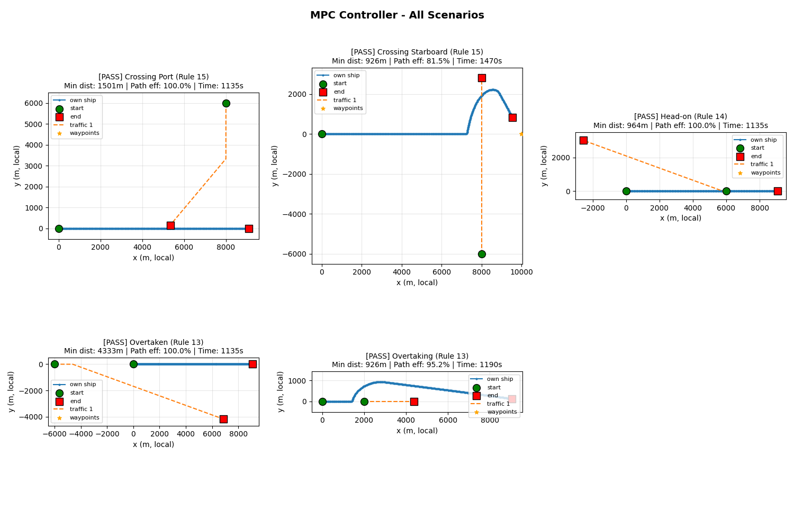
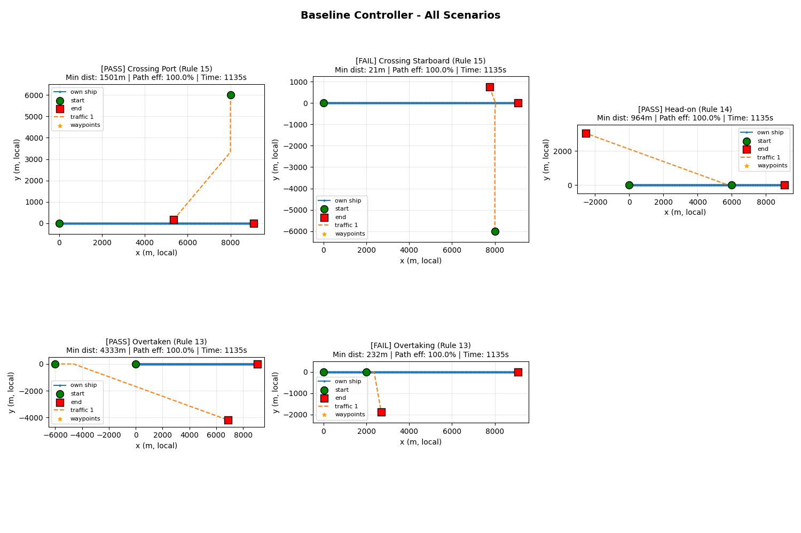

# Benchmarks and Experiments

This document details the experimental setup and results for benchmarking the Model Predictive Control (MPC) ship navigation system against a standard baseline.

These experiments and results can be reproduced by running
```
cd path/to/project_root/ && python ./example/sim/run_colreg_benchmark_scenario.py
```

## Baseline Controller

To evaluate the performance of the MPC controller, we implemented a simple **Baseline Waypoint Controller**.

*   **Mechanism & Logic**: Uses the global planner to determine the shortest path and follows it without any constraints.
*   **Limitations**: Crucially, this controller **does not have any collision avoidance logic**. It is purely reactive to the route and ignores dynamic obstacles (other vessels).
*   **Purpose**: It serves as a control to demonstrate what happens without active collision avoidance and provides a baseline for path efficiency and travel time when no deviations are made.

## Scenarios

We evaluated both controllers on a suite of 5 standard COLREG (International Regulations for Preventing Collisions at Sea) scenarios:

1.  **Head-on (Rule 14)**: Two vessels meeting on reciprocal courses.
2.  **Crossing Starboard (Rule 15)**: Traffic vessel crossing from the starboard side (Own ship is the give-way vessel).
3.  **Crossing Port (Rule 15)**: Traffic vessel crossing from the port side (Own ship is the stand-on vessel).
4.  **Overtaking (Rule 13)**: Own ship overtaking a slower vessel.
5.  **Overtaken (Rule 13)**: Own ship being overtaken by a faster vessel.

## Evaluation Metrics

The following metrics were used to quantify performance:

*   **Success Rate**: Percentage of scenarios completed without collision (Minimum Distance > Collision Radius).
*   **Minimum Distance**: The closest distance recorded between the own ship and any traffic vessel.
*   **Path Efficiency**: The ratio of the straight-line distance to the actual path length traveled ($ \frac{\text{Straight Line}}{\text{Actual Path}} \times 100\% $).
*   **Max Lateral Deviation**: The maximum perpendicular distance the vessel deviated from the straight-line route.
*   **Completion Time**: Total time taken to reach the final waypoint.

## Visual Comparison

The following plots visualize the trajectories generated by both controllers across all scenarios.

### MPC Controller Trajectories
The MPC controller successfully deviates from the path to satisfy COLREGs (e.g., turning starboard for head-on and crossing starboard scenarios).



### Baseline Controller Trajectories
The baseline controller sticks strictly to the path, resulting in collisions in the "Crossing Starboard" and "Overtaking" scenarios where action was required.



## Benchmark Results

Below is the raw output from the benchmark suite, comparing the MPC controller against the Baseline.

```text
====================================================================================================
COLREG BENCHMARK REPORT - MPC vs Baseline Comparison
====================================================================================================

Scenario                       Controller   Status     Min Dist (m)    Path Eff     Max Dev (m)     Time (s)  
----------------------------------------------------------------------------------------------------
Crossing Port (Rule 15)        MPC          PASS             1501.1      100.0%               0.0       1135.0
Crossing Port (Rule 15)        Baseline     PASS             1501.1      100.0%               0.0       1135.0
Crossing Starboard (Rule 15)   MPC          PASS              926.1       81.5%            2219.8       1470.0
Crossing Starboard (Rule 15)   Baseline     FAIL               20.9      100.0%               0.0       1135.0
Head-on (Rule 14)              MPC          PASS              964.1      100.0%               0.0       1135.0
Head-on (Rule 14)              Baseline     PASS              964.1      100.0%               0.0       1135.0
Overtaken (Rule 13)            MPC          PASS             4332.8      100.0%               0.0       1135.0
Overtaken (Rule 13)            Baseline     PASS             4332.8      100.0%               0.0       1135.0
Overtaking (Rule 13)           MPC          PASS              926.4       95.2%             934.0       1190.0
Overtaking (Rule 13)           Baseline     FAIL              231.7      100.0%               0.0       1135.0

----------------------------------------------------------------------------------------------------
SUMMARY STATISTICS BY CONTROLLER
----------------------------------------------------------------------------------------------------

MPC:
  Success rate: 5/5 (100.0%)
  Average minimum distance: 1730.1 m
  Average path efficiency: 95.3%
  Average max lateral deviation: 630.8 m
  Average completion time: 1213.0 s

Baseline:
  Success rate: 3/5 (60.0%)
  Average minimum distance: 2266.0 m
  Average path efficiency: 100.0%
  Average max lateral deviation: 0.0 m
  Average completion time: 1135.0 s

----------------------------------------------------------------------------------------------------
MPC vs BASELINE COMPARISON
----------------------------------------------------------------------------------------------------
Success rate (no collision): MPC 5/5 vs Baseline 3/5
Min distance: MPC 1730.1m vs Baseline 2266.0m (-23.6%)
Path efficiency: MPC 95.3% vs Baseline 100.0% (-4.7%)
====================================================================================================
```

## Summary

The benchmark results clearly demonstrate the effectiveness of the MPC controller in ensuring safety and COLREG compliance compared to the non-reactive Baseline.

- **Safety & Reliability**: The MPC controller achieved a **100% success rate**, successfully avoiding collisions in all 5 scenarios. In contrast, the Baseline controller **failed in 40% of cases** (Crossing Starboard and Overtaking), resulting in collisions.

- **COLREG Compliance**: The MPC controller correctly identified "give-way" situations. It initiated significant course alterations in the Crossing Starboard (Max Dev: 2219m) and Overtaking (Max Dev: 934m) scenarios to maintain safe separation. Conversely, in "stand-on" scenarios like Crossing Port and Overtaken, it correctly maintained its course, matching the efficiency of the Baseline.

- **Performance Trade-off**: Safety comes with a minor efficiency cost. The MPC controller showed a **4.7% reduction in path efficiency** and a **~6.9% increase in completion time** on average compared to the Baseline. This confirms that the MPC optimizes for safety constraints rather than purely minimizing distance when collision risks are present.